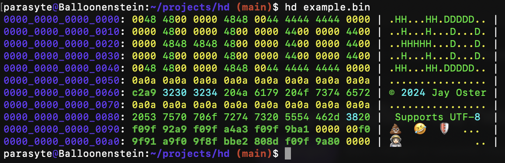

[](https://crates.io/crates/hd "Crates.io version")
[](https://github.com/rust-secure-code/safety-dance/)
[](https://github.com/parasyte/hd/actions "CI")
[](https://github.com/parasyte/hd/commits "Commit activity")
[](https://github.com/sponsors/parasyte "Sponsors")

# `hd`

Hex Display: A modern `xxd` alternative.



# Installing

```bash
cargo install hd
```
